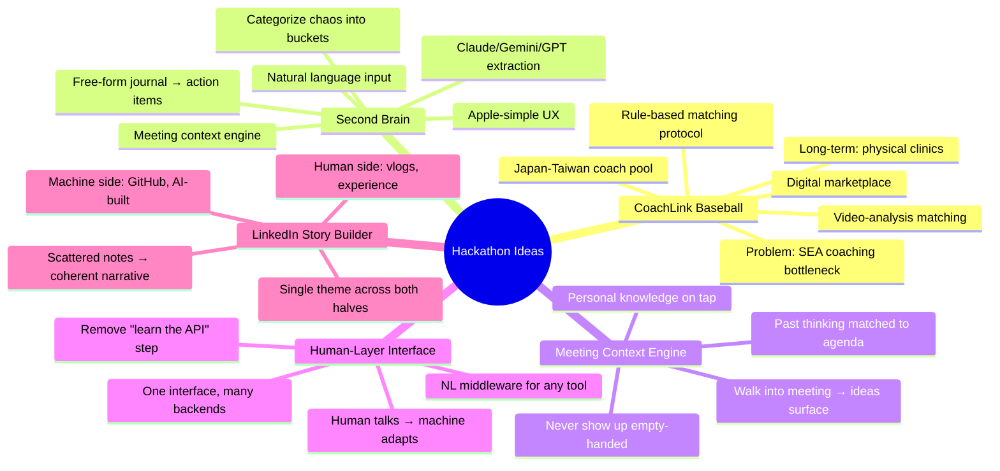
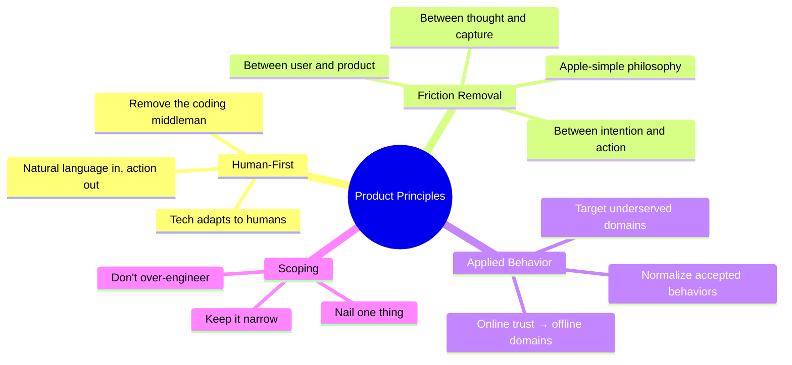
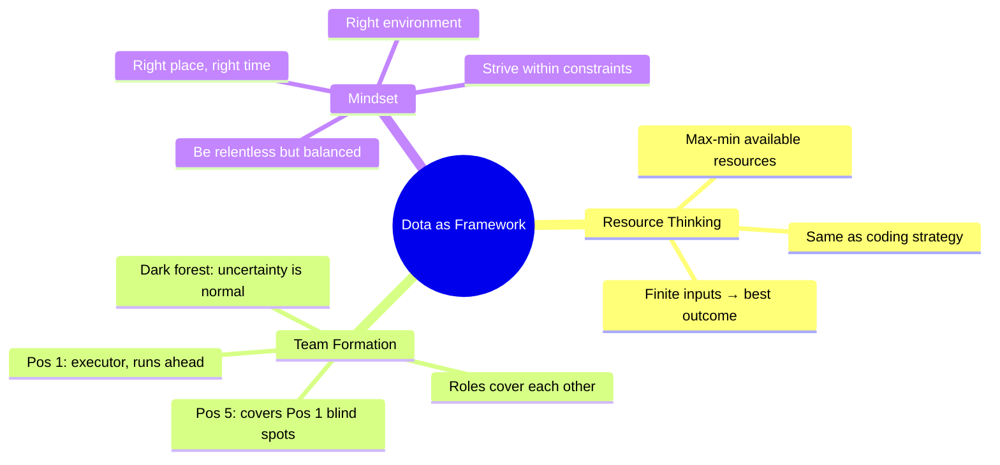
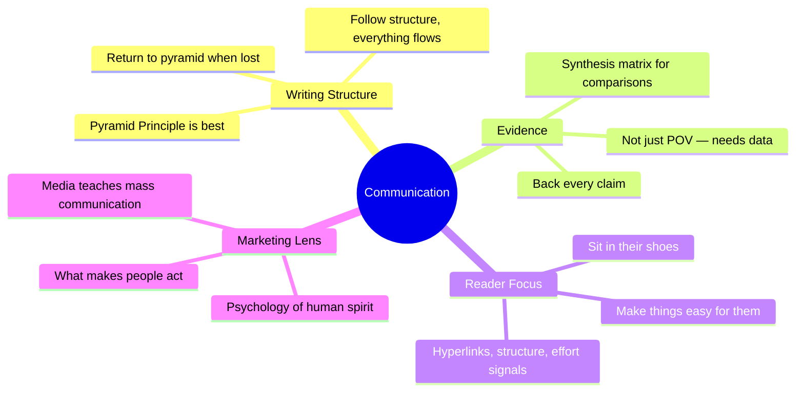
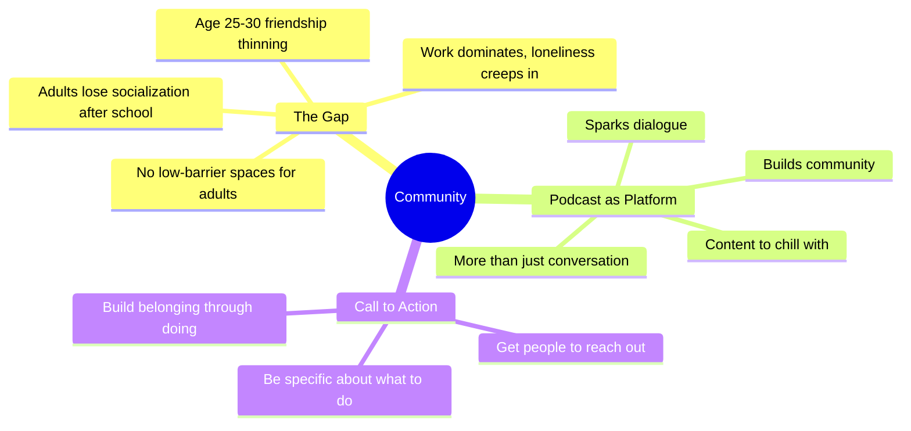
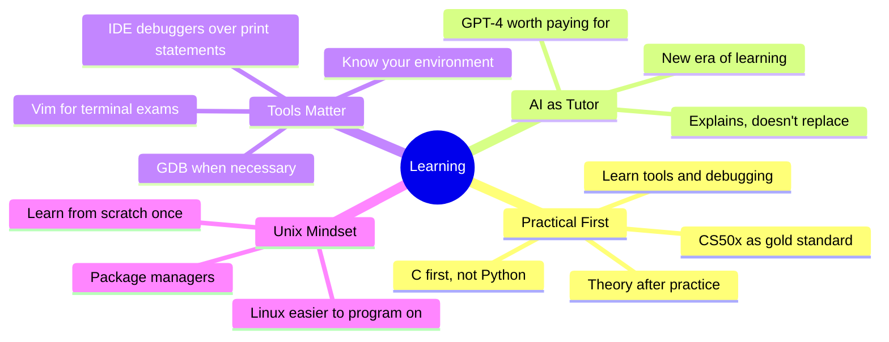

# Idea Mindmaps

*Ideas from Apple Notes, split into focused mindmaps by domain. Each mindmap renders visually on GitHub.*

> Last updated: 2026-06-28
> Source: Apple Notes (#5, #8, #11, #14, #15, #85, #89, #128)

---

## 1. Hackathon & Projects

*Concrete project ideas with pitch-ready details.*

### Pitch Cards

#### CoachLink Baseball

| | |
|---|---|
| **Problem** | SEA baseball coaching stuck in the past — geographical bottleneck, tiny local coach pool, players rely on unguided YouTube |
| **Insight** | Society normalizes online-first commerce/trust — but amateur sports coaching remains hyper-local, driven by luck on Discord or word-of-mouth |
| **Solution** | Digital marketplace connecting SEA players with world-class coaches in Japan and Taiwan via video-analysis matching |
| **MVP** | Eliminate friction of first connection — rule-based matching, side-by-side coach comparison, single-click video upload |
| **Long-term** | Hybrid ecosystem: digital trust → physical clinics, regional camps, athletic mentorship |
| **Key line** | *"Great startups apply already accepted societal behaviors to highly underserved domains"* |

#### Second Brain / Grey App

| | |
|---|---|
| **Core insight** | People think freely and chaotically. A product should capture that chaos and make it useful — not force structure upfront |
| **Input** | Free-form journal entry, stream of consciousness, no guided questions — just write when the spark hits |
| **Output** | Action items, knowledge gaps, books to read, decisions to make, categorized ideas |
| **Differentiator** | Deeply understands the user over time — non-judgmental, always available, personal context engine |
| **Meeting use** | Walk into a meeting, the app surfaces relevant past thinking for that context — you never show up empty |
| **Design** | Apple-like: keep it simple, remove every step between thought and capture |

#### Meeting Context Engine

| | |
|---|---|
| **Problem** | You have hundreds of scattered notes and ideas. When you walk into a meeting, none of them are accessible. |
| **Insight** | The most useful knowledge is the knowledge you can retrieve at the right moment — not what you've stored perfectly |
| **Solution** | A lightweight app that matches your past thinking to your current context (meeting title, agenda, attendees) and surfaces the relevant ideas |
| **MVP** | Input meeting context → app scans your notes → returns top 3-5 relevant past ideas/knowledge gaps/questions |
| **Differentiator** | Not a note-taker — a note-surfacer. It doesn't ask you to organize; it does the retrieval for you |

#### Human-Layer Interface

| | |
|---|---|
| **Problem** | Every tool has its own interface, API, and learning curve. Humans adapt to machines instead of the reverse |
| **Core belief** | Technology should adapt to how humans naturally think — natural language in, structured action out |
| **Solution** | A middleware layer that sits between human natural language and any backend tool/API — one interface, many backends |
| **MVP** | Single chat-style input → routes to appropriate tool (calendar, notes, git, database) based on intent |
| **Key line** | *"Remove the coding step — let humans talk to machines at the human layer"* |

---

## 2. Product Design Principles

*How to build things that feel right.*

---

## 3. Dota as Mental Model

*How MOBA maps onto life, teams, and strategy.*

---

## 4. Communication & Writing

*How to write, speak, and get ideas across.*

---

## 5. Community & Belonging

*What people need beyond work and school.*

---

## 6. Learning Philosophy

*How to approach learning — from someone who's thought about it.*

---

## Quick Reference: All Projects at a Glance

| Project | One-liner | Status |
|---|---|---|
| **CoachLink Baseball** | Marketplace connecting SEA players with Japan/Taiwan coaches via video analysis | Hackathon pitch |
| **Second Brain** | Free-form journal → structured action items, meeting-ready context | Concept |
| **Meeting Context Engine** | Surfaces relevant past thinking when you walk into a meeting | Concept |
| **Human-Layer Interface** | Natural language middleware — one interface, any backend | Concept |
| **LinkedIn Story Builder** | Scattered notes → coherent professional narrative | Concept |
