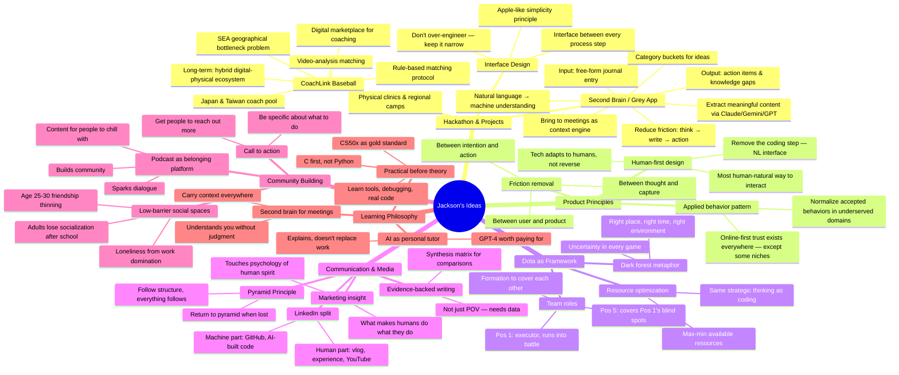

# Idea Mindmap

*All ideas extracted from Apple Notes, organized by domain. Renders as a visual mindmap on GitHub.*

> Last updated: 2026-06-28
> Source: Apple Notes (#5, #8, #11, #14, #15, #85, #89)

---

## Hackathon-Ready Ideas

*Pull these for pitch meetings, ideation sessions, or hackathon prep.*

### CoachLink Baseball (Pitch-Ready)

| Element | Details |
|---|---|
| **Problem** | SEA baseball coaching stuck in past — geographical bottleneck, tiny local coach pool, players rely on unguided YouTube |
| **Insight** | Society normalizes online-first commerce/trust — but amateur sports coaching remains hyper-local and fragmented by luck |
| **Solution** | Digital marketplace connecting SEA players with Japan/Taiwan coaches via video-analysis matching |
| **MVP Focus** | Eliminate friction of first connection — rule-based matching, side-by-side coach comparison, single-click upload |
| **Long-term** | Hybrid ecosystem: digital trust → physical clinics, regional camps, athletic mentorship |
| **Key line** | "Great startups apply already accepted societal behaviors to highly underserved domains" |

### Second Brain / Grey App

| Element | Details |
|---|---|
| **Core insight** | People think freely and chaotically. A product should capture that chaos and make it useful — not force structure upfront |
| **Input** | Free-form journal entry, stream of consciousness, no guided questions |
| **Output** | Action items, knowledge gaps to fill, books to read, decisions to make |
| **Differentiator** | Deeply understands the user over time — non-judgmental, always available, personal context engine |
| **Meeting use** | Bring to meetings — it surfaces relevant past ideas for the current context |
| **Design principle** | Apple-like: keep it simple, remove friction between user and product |

### Design Principles (Applicable to Any Project)

- Technology should adapt to how humans naturally think — natural language in, structured insight out
- Remove the step between intention and action
- AI handles intelligence/computation; humans handle compassion/determination
- The best product is one that is closest to the user's actual thinking patterns
- Don't over-engineer — keep scope narrow, nail one thing
